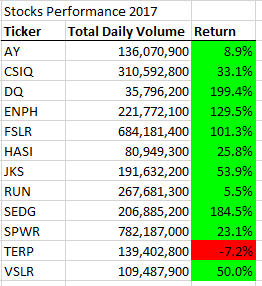
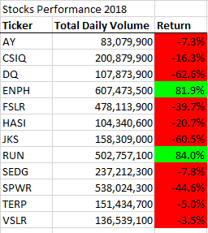
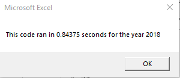

# VBA-Challenge

## Overview of Project
### The purpose
To analyse the performance of a big number of stocks over a few years to help in the research on stock selection
### Background – 
Since there are several stocks over the years it might be difficult to track the performance of each manually. Also writing a code for each stock can also take up equal amount of efforts and lead to many errors. So one of the ways is to refactor where you use a previous code  to loop through all the data one time in order to collect the same information that you did in the previous analysis.

## Results
### Stock analysis Results:
- On analysing several stocks over the years 2017 and 2018 it shows that not all stock performed well over the period. As you can see in the screen shot of the results all except 2 stocks had a downward trend on returns. 
- The Stocks that Steve’s parents were looking forward to buying, the DQ was a major looser among others. The stock that fared well were ENPH and the RUN. 
- Steve can propose these 2 stocks to his parents as a better option to buy considering they are performing well.

         

### VBA Code Results:
- The New VBA code with refactoring reduces the run time in processing it considerably. The original code ran for close to a second while the refactored one ran for less than half a second.

## Summary
### Advantages and disadvantages of refactoring code in general:
#### Advantages
- Code Refactoring is a way of restructuring and optimizing existing code without changing its behavior. It is a way to improve the code quality. 
- Sometimes to reduce bad patterns like duplicate code, long methods, large classes, etc. that are detected in the code it should be refactored.
- Codes are written badly in some cases, and so many bugs are raised. In this case, fixing of bugs take too much effort. So, the root cause of bugs can be code smell. So, before fixing bugs code should be refactored.
#### Disadvantages
- Refactoring the code can be a exhaustive process as you need to make sure there are no errors and debug them if the code is not running as intended.
- It may not work in every case. Some codes need to be kept basic and avoid the complexity if this needs to be handled by the people who are not so well trained in VBA.
### Advantages and disadvantages of the original and refactored VBA script:
#### Advantages of Refactored:
- The processing time was half of the original VBA code.
- It made the code smarter and would be easier to manage new set of data that would be added in the master file
#### Advantages of Original code:
- This Code was a smaller than the refactored code and easy to edit for and debug for a new person at VBA due to less complexity.
